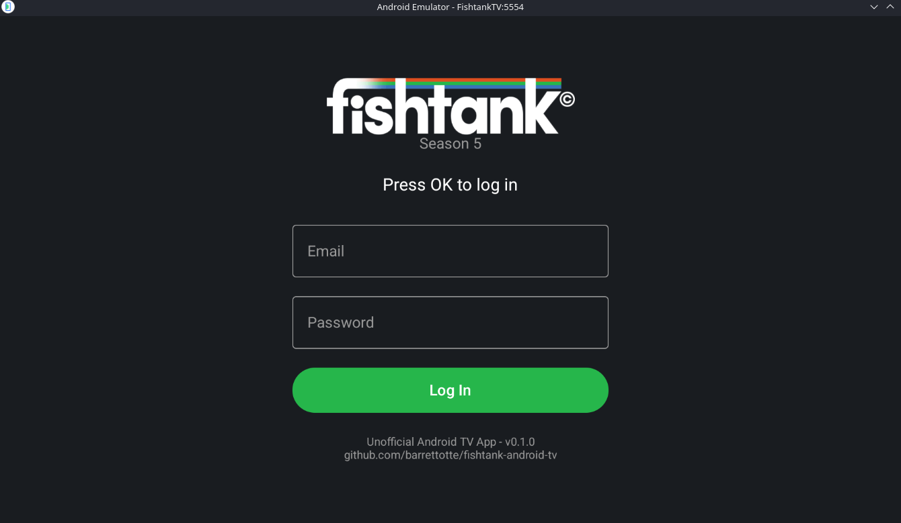
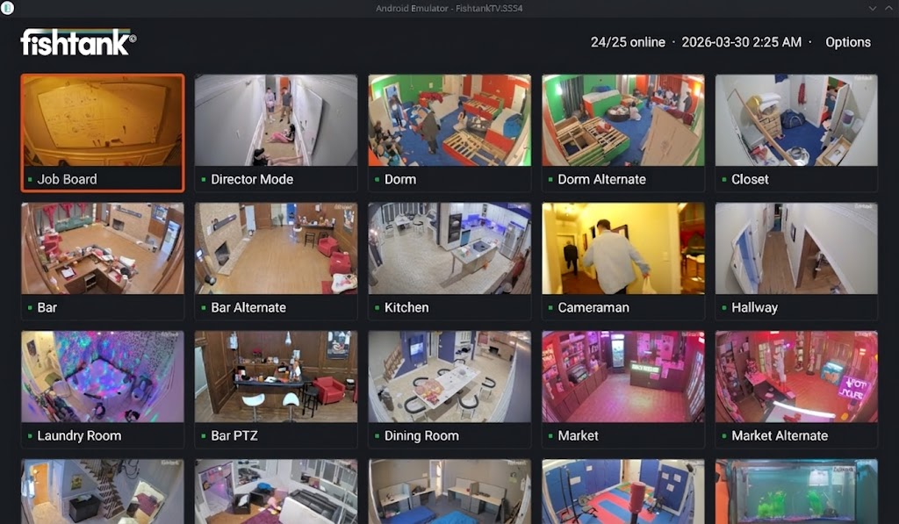
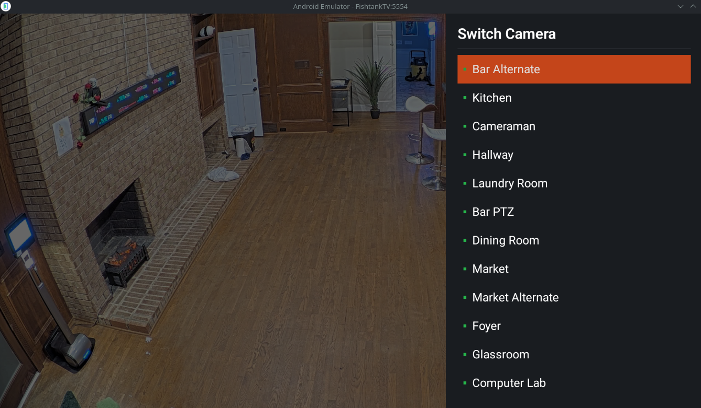
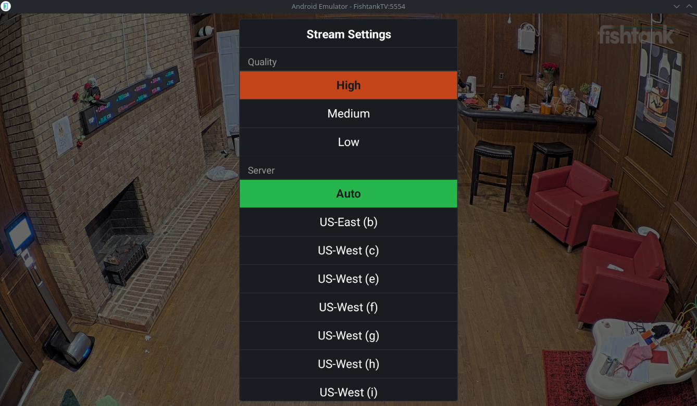
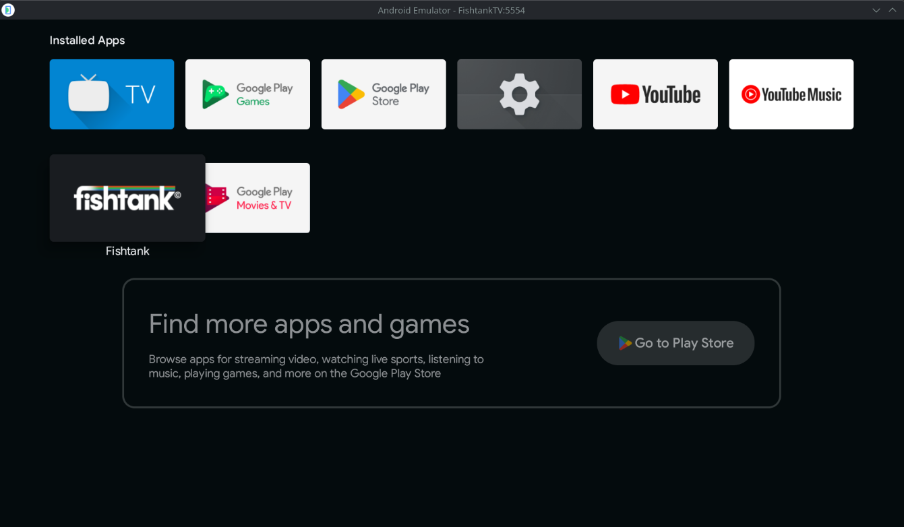

# fishtank-android-tv

A basic app for watching Fishtank.live on Android TV (unofficial).

Port of the [Roku app](https://github.com/barrettotte/fishtank-roku-app) to Android TV / Fire TV.

## Features

- Login with Fishtank.live email/password
- Auto-login with cached tokens on subsequent launches
- Camera grid with live thumbnails and online/offline indicators
- Full-screen HLS video playback
- Switch cameras without leaving the player (press Up)
- Stream quality selection: High / Medium / Low (press Down)
- Edge server override for outages (press Down)
- Quality and server preferences persist across sessions
- Automatic token refresh via background re-login on stream errors








## Controls

### Camera Grid
| Button | Action |
|--------|--------|
| D-pad | Navigate cameras |
| OK | Open selected camera stream |
| Menu | Log out |

### Video Player
| Button | Action |
|--------|--------|
| OK | Show camera name, quality, and server info |
| Up | Open camera switcher |
| Down | Open stream settings (quality and server) |
| Back | Return to camera grid |

### Camera Switcher (in player)
| Button | Action |
|--------|--------|
| Up / Down | Navigate camera list |
| OK | Switch to selected camera |
| Back | Close switcher |

## Install (Sideload)

Download the latest APK from [Releases](https://github.com/barrettotte/fishtank-android-tv/releases).

> **Note:** This app is not available on the Google Play Store or Amazon Appstore. It uses an unofficial, reverse-engineered API and is not affiliated with Fishtank.live. Sideloading is the only way to install it.

### Fire TV Stick

1. On the Fire TV Stick: **Settings > My Fire TV > Developer Options**
   - Enable **ADB Debugging**
   - Enable **Apps from Unknown Sources**
2. Note the IP from **Settings > My Fire TV > About > Network**
3. From a computer on the same network with [ADB](https://developer.android.com/tools/adb) installed:

```sh
adb connect <fire-tv-ip>:5555
adb install fishtank-android-tv-v0.1.0.apk
```

Or install the [Downloader](https://www.amazon.com/dp/B01N0BP507) app on the Fire TV and enter the APK download URL from GitHub releases directly.

> **Note:** Requires Fire TV Stick 3rd Gen or newer (Android 6.0+ / Fire OS 6+). Fire TV Stick 2nd Gen and older are not supported. If Developer Options is hidden, go to **Settings > My Fire TV > About** and click the device name 7 times to unlock it.

### Fire TV (Cube, Smart TV, etc.)

1. **Settings > My Fire TV > Developer Options**
   - Enable **ADB Debugging**
   - Enable **Apps from Unknown Sources**
2. Install via ADB from a computer or use the Downloader app (same as above)

### Android TV (Google TV, Sony, Nvidia Shield, etc.)

1. **Settings > Device Preferences > About** and click **Build** 7 times to enable Developer Options
2. **Settings > Device Preferences > Developer Options**
   - Enable **USB Debugging** (or **Network Debugging** for wireless ADB)
   - Enable **Install from Unknown Sources**
3. Install via ADB:

```sh
adb connect <tv-ip>:5555
adb install fishtank-android-tv-v0.1.0.apk
```

Or use a file manager app to open the APK from a USB drive.

### Credential Storage

All sensitive data stored on the device is encrypted using [Android Keystore](https://developer.android.com/privacy-and-security/keystore) with AES-256-GCM. The encryption key is hardware-backed and never leaves the device.

| Data | Encrypted | Purpose |
|------|-----------|---------|
| Email | Yes | Background re-login for token refresh |
| Password | Yes | Background re-login for token refresh |
| Access Token | Yes | REST API authentication |
| Live Stream Token | Yes | HLS stream URL JWT parameter |
| Display Name | No | Shown in header (non-sensitive) |
| Quality / Server | No | User preferences (non-sensitive) |

Credentials are stored to allow the app to re-login automatically in the background to refresh the stream token (JWT), which expires every 30 minutes.

## Developer Setup

### Prerequisites

- JDK 17
- Android SDK (cmdline-tools, platform-tools, build-tools 34.0.0, API 34-35)
- Android TV emulator (included with Android SDK) or a Fire TV / Android TV device on the same network for physical testing

> **Note:** This app has only been tested with the Android TV emulator. Physical device testing (Fire TV Stick 3rd Gen+, Android TV boxes, etc.) is untested but should work with any device running Android 6.0+ (API 23+).

### Install

```sh
git clone https://github.com/barrettotte/fishtank-android-tv.git
cd fishtank-android-tv
cp .env.example .env
```

### Android SDK Setup (Arch Linux)

```sh
sudo pacman -S jdk17-openjdk

mkdir -p $HOME/Android/Sdk/cmdline-tools
cd /tmp
curl -sLO "https://dl.google.com/android/repository/commandlinetools-linux-14742923_latest.zip"
unzip commandlinetools-linux-14742923_latest.zip
mv cmdline-tools $HOME/Android/Sdk/cmdline-tools/latest
rm commandlinetools-linux-14742923_latest.zip

# Add to .zshrc or .bashrc
export ANDROID_HOME=$HOME/Android/Sdk
export ANDROID_AVD_HOME=$HOME/.config/.android/avd
export PATH="$ANDROID_HOME/cmdline-tools/latest/bin:$ANDROID_HOME/platform-tools:$ANDROID_HOME/emulator:$PATH"

# Install SDK packages
sdkmanager "platform-tools" "platforms;android-34" "platforms;android-35" \
    "build-tools;34.0.0" "emulator" "system-images;android-34;android-tv;x86"
yes | sdkmanager --licenses
```

### Enable ADB on Fire TV Stick

1. Go to **Settings > My Fire TV > Developer Options**
2. Enable **ADB Debugging**
3. Enable **Apps from Unknown Sources**
4. Note the IP from **Settings > My Fire TV > About > Network**
5. Run `adb connect <ip>:5555` - accept the "Allow USB debugging?" dialog on the TV screen and check "Always allow from this computer"

> If Developer Options is hidden, go to **Settings > My Fire TV > About** and click the device name 7 times to unlock it.

6. Edit `.env` with your device IP:
   ```
   FIRE_TV_IP=192.168.1.100
   ```

### Build and Deploy

```sh
make deploy
```

This builds the debug APK and installs it onto the Fire TV Stick.

### Emulator

Uses the `android-tv` system image which provides the Android TV launcher with Leanback home screen and D-pad navigation.

```sh
# one-time setup
make avd_create

# build, launch emulator, install, and run
make emulate
```

> **If emulator keys aren't working:** The AVD may have `hw.keyboard=no` by default. Edit `$ANDROID_AVD_HOME/FishtankTV.avd/config.ini` and set `hw.keyboard=yes`, then also set `hw.keyboard = true` in `hardware-qemu.ini` in the same directory. Kill the emulator and relaunch.

### Debugging

```sh
# view app logs
make debug

# view emulator logs
make debug_emu
```

### Other Commands

```sh
make lint     # run Android lint
make test     # run unit tests
make clean    # delete build output
```

## References

- [Compose for TV](https://developer.android.com/training/tv/playback/compose)
- [Leanback Library](https://developer.android.com/training/tv/start/start)
- [ExoPlayer / Media3](https://developer.android.com/media/media3/exoplayer)
- [Retrofit](https://square.github.io/retrofit/)
- [Fire TV Development](https://developer.amazon.com/docs/fire-tv/getting-started-developing-apps-and-games.html)
